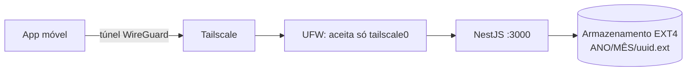

# MURUS Backend

API do **MURUS**: uma nuvem privada e auto-hospedada para backup estruturado e streaming de fotos e vídeos do celular, pensada como alternativa autônoma a serviços como Google Fotos e iCloud. Os dados ficam em um servidor doméstico sob seu controle, acessível apenas por um túnel criptografado (Tailscale), sem expor portas na internet pública.


---

## Sumário

- [Funcionalidades](#funcionalidades)
- [Arquitetura](#arquitetura)
- [Início rápido (máquina local)](#início-rápido-máquina-local)
- [Configuração](#configuração)
- [Referência da API](#referência-da-api)
- [Segurança](#segurança)
- [Estrutura do projeto](#estrutura-do-projeto)
- [Scripts e testes](#scripts-e-testes)
- [Deploy no servidor (Ubuntu + Tailscale)](#deploy-no-servidor-ubuntu--tailscale)
- [Solução de problemas](#solução-de-problemas)
- [Limitações conhecidas e roadmap](#limitações-conhecidas-e-roadmap)

---

## Funcionalidades

- **Upload** de fotos e vídeos (`multipart/form-data`) com nome gerado no servidor (UUID), sem risco de sobrescrever arquivos de mesmo nome.
- **Organização automática** em pastas `ANO/MÊS` (ex.: `2026/05/<uuid>.jpg`).
- **Listagem paginada**, mais recentes primeiro, filtrável por tipo (`image` / `video`).
- **Entrega de arquivos com suporte a `Range` (HTTP 206)**: o vídeo é transmitido do disco em partes, sem carregar o arquivo na RAM, e permite avançar a barra de progresso.
- **Validação em camadas** no upload: extensão permitida, `Content-Type` plausível, limite de tamanho e verificação dos *magic bytes* do conteúdo real.
- **Autenticação por token** (Bearer) e **limite de requisições** por IP.
- **Health check** público para monitoramento.
- **Configuração por variáveis de ambiente**, validada na inicialização (a aplicação não sobe com configuração inválida).
- **Proteção contra disco desmontado**: opcionalmente exige um arquivo-marcador para não gravar mídias no disco do sistema caso o cartão SD não esteja montado.

Formatos aceitos: `jpg`, `jpeg`, `png`, `webp`, `gif`, `heic`, `heif`, `mp4`, `m4v`, `mov`, `webm`.

## Arquitetura



| Camada | Tecnologia |
| --- | --- |
| Runtime / linguagem | Node.js ≥ 20 (recomendado 22 LTS), TypeScript |
| Framework | NestJS 11 (Express) |
| Upload | Multer (`diskStorage`) |
| Configuração | `@nestjs/config` com validação própria |
| Proteção | `@nestjs/throttler` + guard de token |
| Processos (produção) | PM2 |

Módulos principais: `StorageModule` (único ponto que conhece o disco e resolve caminhos com segurança), `MediaModule` (upload, listagem e entrega), `HealthModule` e um guard global de autenticação.

## Início rápido (máquina local)

**Requisitos:** Node.js 20 ou superior (`node -v`) e npm.

```bash
# 1. Instalar dependências
npm install

# 2. Criar o arquivo de configuração
cp .env.example .env          # Windows (PowerShell): Copy-Item .env.example .env

# 3. Subir em modo desenvolvimento (recarrega ao salvar)
npm run start:dev
```

Sem nenhum ajuste, a API sobe em `http://localhost:3000` e grava as mídias em `./storage` (pasta ignorada pelo Git). Para apontar para outra pasta, edite `STORAGE_PATH` no `.env`, por exemplo `STORAGE_PATH=C:/murus-dados` no Windows.

Teste rápido:

```bash
curl http://localhost:3000/health
curl -F "file=@foto.jpg" http://localhost:3000/media/upload
curl "http://localhost:3000/media/list?limit=10"
```

> No PowerShell, use `curl.exe` (o `curl` puro é um alias de outro comando).

**Acessando do celular na mesma rede Wi-Fi:** mantenha `HOST=0.0.0.0`, descubra o IP da máquina (`ipconfig` no Windows) e use `http://<ip>:3000`. Se o Windows pedir permissão de firewall para o Node.js, autorize apenas em **redes privadas**. Lembre-se de que, sem `API_TOKEN`, qualquer dispositivo da sua rede local consegue usar a API; defina um token se isso for um problema.

## Configuração

Toda a configuração vem de variáveis de ambiente (arquivo `.env`; veja [`.env.example`](.env.example)).

| Variável | Padrão | Descrição |
| --- | --- | --- |
| `NODE_ENV` | `development` | `development`, `production` ou `test`. Em `production`, `API_TOKEN` é obrigatório. |
| `PORT` | `3000` | Porta TCP. |
| `HOST` | `0.0.0.0` | Interface de escuta. Use `127.0.0.1` para aceitar só a própria máquina. |
| `STORAGE_PATH` | `./storage` | Pasta raiz das mídias (`ANO/MÊS/...`). |
| `REQUIRE_STORAGE_MARKER` | `false` | Se `true`, exige o arquivo `.murus-storage` na raiz do armazenamento (veja [Segurança](#segurança)). |
| `MAX_FILE_SIZE_MB` | `2048` | Tamanho máximo por arquivo, em MB. |
| `API_TOKEN` | *(vazio)* | Token Bearer, mínimo 32 caracteres. Vazio = API sem autenticação (só para desenvolvimento). |
| `RATE_LIMIT_PER_MINUTE` | `300` | Requisições por minuto, por IP. |
| `CORS_ORIGINS` | *(vazio)* | Origens CORS permitidas, separadas por vírgula. Vazio = CORS desligado (o app nativo não precisa). |

Gerar um token forte:

```bash
node -e "console.log(require('crypto').randomBytes(32).toString('hex'))"
```

## Referência da API

Quando `API_TOKEN` está definido, todas as rotas (exceto `/health`) exigem o cabeçalho:

```
Authorization: Bearer <API_TOKEN>
```

### `GET /health` (público)

```json
{ "status": "ok", "storage": "ok", "uptimeSeconds": 3600 }
```

`status` vira `"degraded"` (e `storage` `"unavailable"`) se o armazenamento não estiver acessível.

### `POST /media/upload`

Corpo `multipart/form-data` com o campo **`file`** (um arquivo por requisição).

```bash
curl -X POST http://localhost:3000/media/upload \
  -H "Authorization: Bearer $API_TOKEN" \
  -F "file=@foto.jpg"
```

Resposta `201 Created`:

```json
{
  "message": "Upload realizado com sucesso!",
  "filename": "3f6c0d52-8f0a-4a52-9d7e-2b1f6f1c9a10.jpg",
  "path": "/2026/05/3f6c0d52-8f0a-4a52-9d7e-2b1f6f1c9a10.jpg",
  "url": "/media/file/2026/05/3f6c0d52-8f0a-4a52-9d7e-2b1f6f1c9a10.jpg",
  "type": "image",
  "size": 2048576
}
```

### `GET /media/list`

Lista mídias, mais recentes primeiro.

| Parâmetro | Padrão | Descrição |
| --- | --- | --- |
| `limit` | `100` | Itens por página (1–500). |
| `offset` | `0` | Quantidade de itens a pular. |
| `type` | *(todos)* | `image` ou `video`. |

```json
{
  "total": 42,
  "limit": 100,
  "offset": 0,
  "items": [
    {
      "filename": "3f6c0d52-8f0a-4a52-9d7e-2b1f6f1c9a10.jpg",
      "urlPath": "/2026/05/3f6c0d52-8f0a-4a52-9d7e-2b1f6f1c9a10.jpg",
      "url": "/media/file/2026/05/3f6c0d52-8f0a-4a52-9d7e-2b1f6f1c9a10.jpg",
      "type": "image",
      "size": 2048576,
      "uploadedAt": "2026-05-15T14:32:00.000Z",
      "period": "2026-05"
    }
  ]
}
```

A listagem é mantida em cache por até 30 segundos e invalidada a cada upload. `uploadedAt` vem da data de gravação do arquivo no servidor.

### `GET /media/file/:ano/:mes/:arquivo`

Entrega o arquivo (use o campo `url` da listagem). Suporta `Range`, `ETag` e `Last-Modified`.

```bash
# primeiros 1 MB de um vídeo (resposta 206 Partial Content)
curl -H "Authorization: Bearer $API_TOKEN" -H "Range: bytes=0-1048575" \
  http://localhost:3000/media/file/2026/05/<uuid>.mp4 -o trecho.mp4
```

### Códigos de erro

| Código | Quando |
| --- | --- |
| `400` | Parâmetro inválido, campo `file` ausente ou caminho de mídia malformado. |
| `401` | Token ausente ou inválido. |
| `404` | Mídia inexistente. |
| `413` | Arquivo maior que `MAX_FILE_SIZE_MB`. |
| `415` | Extensão não suportada ou conteúdo incompatível com a extensão. |
| `429` | Limite de requisições excedido. |
| `503` | Armazenamento indisponível (disco desmontado ou sem permissão). |

## Segurança

O modelo é de **defesa em camadas**; nenhuma camada substitui a rede privada.

1. **Rede (principal):** o servidor só deve ser alcançável pela interface `tailscale0`, sem portas abertas no roteador (veja o [deploy](#deploy-no-servidor-ubuntu--tailscale)).
2. **Autenticação:** token Bearer comparado em tempo constante (SHA-256 + `timingSafeEqual`). É um token único e compartilhado, não há contas de usuário. Trate-o como uma senha e guarde-o apenas no `.env` e no app.
3. **Upload:**
   - o nome original **nunca** é usado: o arquivo é gravado como `<uuid><extensão>`;
   - extensão em lista permitida, `Content-Type` plausível e limite de tamanho;
   - após a gravação, os primeiros bytes do arquivo são conferidos com a extensão; arquivos incompatíveis (ex.: script renomeado para `.jpg`) são apagados e rejeitados.
4. **Entrega de arquivos:** `ano`, `mês` e nome são validados por expressões regulares estritas e o caminho final é conferido contra a raiz do armazenamento (bloqueia `../`). Respostas incluem `X-Content-Type-Options: nosniff`.
5. **Abuso:** limite de requisições por IP e de um arquivo por requisição.
6. **Configuração:** em produção a aplicação não inicia sem um `API_TOKEN` forte; segredos ficam fora do Git (`.env` ignorado).
7. **Disco desmontado:** com `REQUIRE_STORAGE_MARKER=true`, a API recusa gravar se `.murus-storage` não existir na raiz. Sem isso, um cartão SD desmontado faria as mídias serem gravadas silenciosamente no disco do sistema, no mesmo caminho.

O tráfego dentro do Tailscale já é criptografado (WireGuard), então HTTP simples entre o app e o servidor, dentro da tailnet, não expõe o conteúdo.

## Estrutura do projeto

```
src/
├── main.ts                    # bootstrap (host/porta, CORS opcional, shutdown hooks)
├── app.module.ts              # config, rate limit e guards globais
├── config/
│   └── env.validation.ts      # leitura e validação das variáveis de ambiente
├── common/
│   ├── api-token.guard.ts     # autenticação por token (global)
│   └── public.decorator.ts    # @Public() para rotas sem token
├── storage/
│   ├── storage.module.ts
│   └── storage.service.ts     # raiz, pastas ANO/MÊS, resolução segura de caminhos
├── media/
│   ├── media.module.ts        # Multer: destino, nome, filtro e limites
│   ├── media.controller.ts    # /media/upload, /media/list, /media/file/...
│   ├── media.service.ts       # validação pós-upload, listagem com cache
│   ├── media.utils.ts         # extensões, magic bytes, regex (funções puras)
│   └── media.utils.spec.ts
└── health/
    ├── health.module.ts
    └── health.controller.ts   # /health
```

## Scripts e testes

| Comando | O que faz |
| --- | --- |
| `npm run start:dev` | Desenvolvimento com recarga automática. |
| `npm run build` | Compila para `dist/`. |
| `npm run start:prod` | Executa a versão compilada. |
| `npm run lint` | ESLint (com correção automática). |
| `npm run format` | Prettier. |
| `npm test` | Testes unitários (Jest). |
| `npm run test:cov` | Testes com cobertura. |

Os testes atuais cobrem as funções puras (validação de formatos, magic bytes, proteção contra path traversal) e a validação de configuração. Testes de integração (upload e listagem ponta a ponta) ainda não existem; veja o roadmap.

## Deploy no servidor (Ubuntu + Tailscale)

Guia para quando a API for migrada para o servidor doméstico (Ubuntu Server 24.04).

**1. Node.js 22 LTS e PM2**

```bash
curl -fsSL https://deb.nodesource.com/setup_22.x | sudo -E bash -
sudo apt install -y nodejs
sudo npm install -g pm2
```

**2. Armazenamento.** Monte o cartão SD de forma permanente (`/etc/fstab`, com `nofail`) e crie o marcador **com o disco montado**:

```bash
sudo mkdir -p /mnt/murus/galeria
sudo chown $USER:$USER /mnt/murus/galeria
touch /mnt/murus/galeria/.murus-storage
```

**3. Aplicação**

```bash
git clone <url-do-repositorio> murus-backend && cd murus-backend
npm ci            # ou npm install, se não houver package-lock.json
cp .env.example .env
```

No `.env`: `NODE_ENV=production`, `STORAGE_PATH=/mnt/murus/galeria`, `REQUIRE_STORAGE_MARKER=true` e um `API_TOKEN` forte. Em seguida:

```bash
npm run build
pm2 start ecosystem.config.js
pm2 save
pm2 startup        # execute o comando que ele imprimir
```

**4. Tailscale e firewall.** Instale o Tailscale (`curl -fsSL https://tailscale.com/install.sh | sh`, depois `sudo tailscale up`) e restrinja o firewall. **Libere o SSH antes de ativar o UFW** para não perder o acesso:

```bash
sudo ufw default deny incoming
sudo ufw default allow outgoing
sudo ufw allow in on tailscale0 to any port 22 proto tcp
sudo ufw allow in on tailscale0 to any port 3000 proto tcp
sudo ufw enable
sudo ufw status verbose
```

O app passa a acessar `http://<nome-ou-ip-tailscale>:3000`. O IP da máquina na tailnet é mostrado por `tailscale ip -4`. Opcionalmente, defina `HOST` com esse IP para que a API escute só na interface do Tailscale.

> **Android e HTTP:** apps Android recentes bloqueiam tráfego HTTP sem TLS por padrão. Se o app não conseguir conectar, a alternativa é publicar a API com HTTPS pelo Tailscale (`tailscale serve`; consulte a documentação do Tailscale para a sintaxe da sua versão) ou liberar HTTP para o domínio da tailnet na configuração de rede do app.

## Solução de problemas

| Sintoma | Causa provável e solução |
| --- | --- |
| A aplicação encerra ao iniciar com mensagem sobre `API_TOKEN` / `PORT` etc. | Validação de configuração: leia a mensagem, corrija o `.env`. |
| `503 Armazenamento indisponível` | Pasta inexistente, sem permissão de escrita, ou disco desmontado / sem `.murus-storage`. |
| `EADDRINUSE` | A porta já está em uso: troque `PORT` ou encerre o outro processo. |
| `401` no app | Token diferente do `.env` ou cabeçalho fora do formato `Bearer <token>`. |
| `415` em foto válida | Extensão fora da lista, ou arquivo cujo conteúdo não corresponde à extensão. |
| `413` em vídeo grande | Aumente `MAX_FILE_SIZE_MB`. |
| `429` durante um backup grande | Aumente `RATE_LIMIT_PER_MINUTE`. |
| Celular não alcança o PC | Firewall do Windows bloqueando, redes diferentes, ou `HOST=127.0.0.1`. |

## Limitações conhecidas e roadmap

Limitações atuais, para ficar claro o que a API **não** faz:

- Autenticação por **token único compartilhado**; não há usuários, nem controle de acesso por conta.
- **Sem banco de dados:** os metadados são derivados do sistema de arquivos (data de gravação, tamanho). Não há data original da foto (EXIF), nome original, álbuns nem busca.
- **Sem exclusão** de mídias pela API e **sem miniaturas**: o app precisa baixar o arquivo original para exibir.
- A listagem varre o disco (com cache de 30 s). Para bibliotecas muito grandes, o ideal é indexar em um banco.
- Sem HTTPS próprio: confia no túnel do Tailscale.
- Deduplicação não é feita: enviar o mesmo arquivo duas vezes gera duas cópias.

Próximos passos sugeridos:

- [ ] Testes de integração (upload, listagem, `Range`) com `supertest`
- [ ] Miniaturas de imagens e *poster frames* de vídeos
- [ ] Leitura de EXIF para a data real de captura
- [ ] Índice em SQLite (metadados, busca, deduplicação por hash)
- [ ] Rota de exclusão com lixeira
- [ ] Dockerfile e pipeline de CI (lint, testes, build)

## Licença

Projeto privado, todos os direitos reservados (`UNLICENSED`).
